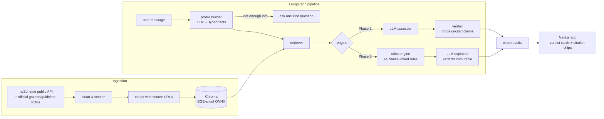

# Adhikaar

**A verifiable public-benefit reasoning engine for Indian welfare schemes.**

Describe your situation in plain language — *"I'm a 45-year-old widow in rural Bihar with a BPL card"* — and Adhikaar tells you which central government welfare schemes you're eligible for, **why**, what documents you need, and how to apply. Every eligibility claim is grounded in and cited to official scheme text.

> **Core principle: it never invents an entitlement.** Eligibility is decided by a deterministic, unit-tested rules engine in which every rule links to its source clause in an official government document. The LLM only (a) turns your messy description into structured facts and (b) phrases the verdict kindly — it never decides. If a needed fact is missing, the system asks instead of guessing.


## Why this architecture

LLM+RAG systems can cite real documents and still *reason* wrongly about eligibility — thresholds, age windows, exclusion clauses. For a civic tool, a hallucinated entitlement is the worst possible failure: it promises money the law doesn't grant. During this project's own baseline run, the LLM judged a 62-year-old **eligible** for PMJJBY — a scheme with an explicit 18–50 enrollment window that was *in its context*.

So Adhikaar is built as an experiment with one variable:

| | Phase 1 (baseline) | Phase 2 (shipped) |
|---|---|---|
| Facts from user text | LLM | LLM |
| Retrieval over official corpus | BGE-small + Chroma | BGE-small + Chroma |
| **Eligibility decision** | **LLM judgment** | **Deterministic rules engine** |
| Verification | claim↔quote containment check | grounded by construction (rule ⇄ clause) |
| Explanation | LLM | LLM (cannot alter verdicts) |

## Architecture



- **Corpus**: 15 central schemes fetched from [myScheme](https://www.myscheme.gov.in) (Government of India's scheme portal) plus official PDFs where a scheme isn't listed there (Sukanya Samriddhi gazette notification; PMS-SC guidelines). 177 section-labeled chunks, each carrying its official source URL. Cleaned corpus is committed — clones don't re-scrape.
- **Rules repository** (`backend/app/rules/schemes/*.yaml`): 44 rules, each one clause of official text made executable, with three-valued logic — `met / failed / unknown`. Unknown facts become questions, never guesses. Facts the state must verify (BPL/SECC lists) are marked `self_declared` and soften verdicts to *likely eligible*.
- **Resilience**: Gemini free tier is the primary LLM with an automatic Groq (Llama 3.3 70B) fallback; every LLM call is disk-cached so re-runs and eval batches don't burn quota.

## Evaluation

A labeled set of **41 synthetic-but-realistic cases** (~90 (profile, scheme) judgments) with deliberate boundary traps — age 59 vs 60, income ₹2.0L vs ₹3.2L against a ₹2.5L cap, daughter aged 9 vs 10 — and abstention probes where the right answer is "ask, don't guess". False positives (promising an entitlement that isn't owed) and false negatives (missing one that is) are reported separately. Faithfulness is judged claim-by-claim against the cited official text by an independent model.

**Results** (2026-07-11, 40/41 cases · 90 labeled pairs — one case skipped in *both* phases after persistent free-tier rate limits, so the comparison is apples-to-apples):

| | LLM-only baseline | Rules-as-code (this system) |
|---|---:|---:|
| Eligibility accuracy | 60.0% | **90.0%** |
| False positives (entitlement promised that isn't owed) | 16 | **0** |
| False negatives (entitlement missed) | 11 | **1** |
| Declined to judge a labeled pair | 9 | 8 |
| Faithfulness — shipped claims supported by their cited official text | 19.2% | **65.7%** |

Both phases share the same retriever and the same generator (Llama 4 Scout 17B via Groq); the only variable is who decides eligibility. Faithfulness is scored claim-by-claim by an independent judge (Llama 3.1 8B) with a strict standard: a claim with no resolvable citation is unsupported *by definition* — which is precisely what sinks the LLM baseline, and why rule-backed reasons (each carrying its official clause) score 3.4× higher. The rules engine's single false negative is a retrieval miss (the scheme never reached the decider), not a wrong decision: **across 90 judgments the rules engine never asserted a false entitlement.**

Retrieval (shared by both phases): precision 0.22 / recall 0.88 — deliberately broad retrieval, strict deciding.

Reproduce: `python -m evals.run_eval --phase llm` then `--phase rules` (all calls cached to disk). Raw run artifacts: `backend/evals/results/`.

## Repository layout

```
backend/
  app/ingestion/   fetch → clean → chunk → embed → index (provenance kept)
  app/retrieval/   semantic search over the corpus
  app/agent/       LangGraph pipeline: profile → retrieve → decide → explain
  app/rules/       the rules engine + versioned YAML rule repository
  app/llm/         disk-cached Gemini/Groq clients + fallback router
  app/api/         FastAPI (OpenAPI-documented)
  evals/           labeled dataset, metrics, faithfulness judge, runner
  tests/           76 tests: every rule in 3 logic states + boundaries + pipeline
web/               Next.js 16 + Tailwind v4 app: guided wizard, cited report,
                   scheme explorer (warm ivory/terracotta design system)
data/corpus/       cleaned official text (committed, with fetch dates)
data/raw/          raw API responses & source PDFs (provenance)
```

## Run it locally

Prerequisites: Python 3.11+, Node 20+, [uv](https://docs.astral.sh/uv/).

```bash
git clone <this-repo> && cd adhikaar

# 1. Keys (both free): https://aistudio.google.com/apikey + https://console.groq.com/keys
cp .env.example .env        # paste GEMINI_API_KEY and GROQ_API_KEY

# 2. Backend
cd backend
uv sync
uv run python -m app.ingestion index    # builds the vector index from the committed corpus
uv run uvicorn app.api.main:app --port 8000

# 3. Frontend (new terminal)
cd web
npm install
cp .env.example .env.local              # points at http://localhost:8000
npm run dev
```

Open http://localhost:3000. Run the tests with `uv run pytest` (backend/).

## Deploy (free tier)

- **Backend → Hugging Face Spaces** (Docker SDK): create a Space, push this repo (the root `Dockerfile` builds the index into the image), add `GEMINI_API_KEY` and `GROQ_API_KEY` as Space secrets. Serves on port 7860.
- **Frontend → Vercel**: import the repo, set root directory to `web/`, set `NEXT_PUBLIC_API_URL` to the Space URL.

## Limitations (honest ones)

- **15 central schemes only.** State schemes — often the most relevant — aren't covered. A "not eligible here" is not "not eligible anywhere".
- **Self-reported facts.** BPL/SECC list membership can't be verified from a conversation; such verdicts are explicitly conditional (*likely eligible*).
- **Simplified rules.** Some rarely-triggered exclusions aren't encoded (e.g. PM-KISAN's constitutional-post holders); PMJAY's ₹10k/month exclusion is approximated from annual income. Every simplification is listed in the rule sign-off notes.
- **PMS-SC provenance.** The official guidelines PDF is a scan; its corpus text is a Gemini transcription cross-checked against the department's pages — flagged for clause-level human verification.
- **English only**, small eval set (counts, not significance claims), and the faithfulness judge shares a model family with the Phase-1 generator (noted bias risk).
- **Not legal advice.** Final decisions always rest with the implementing authorities.

## License & data

Scheme text belongs to the Government of India and is reproduced from public official sources with URLs and fetch dates preserved. No personal data is collected or stored.
