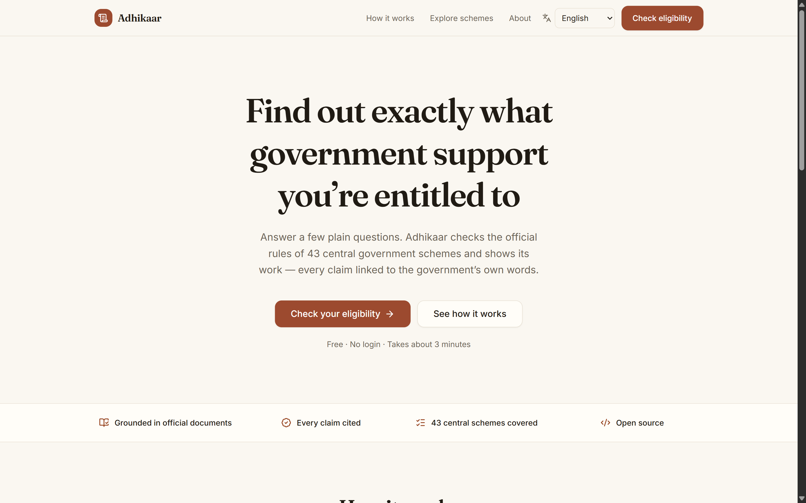
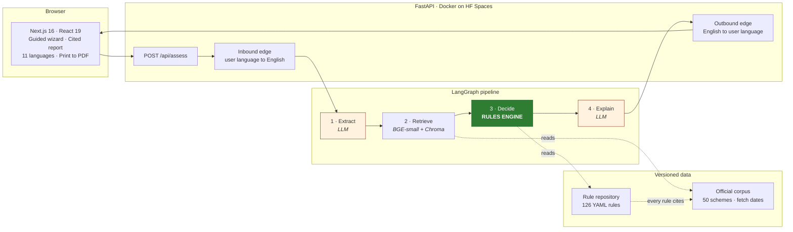
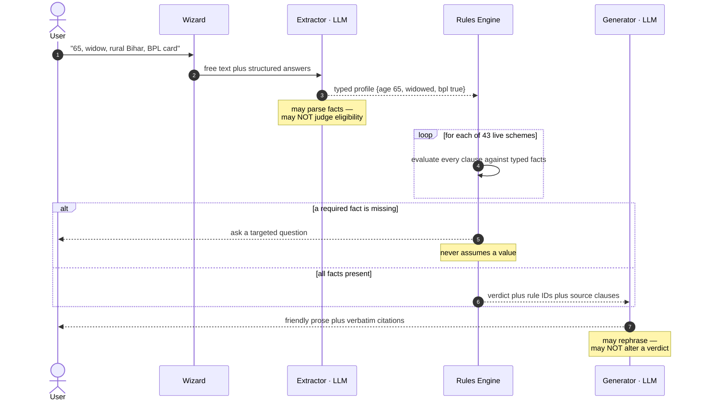
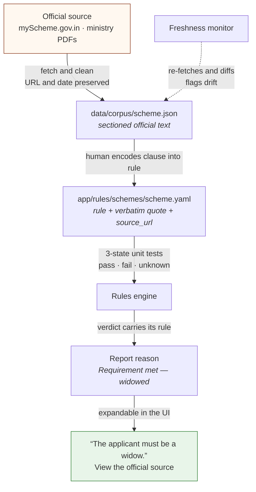
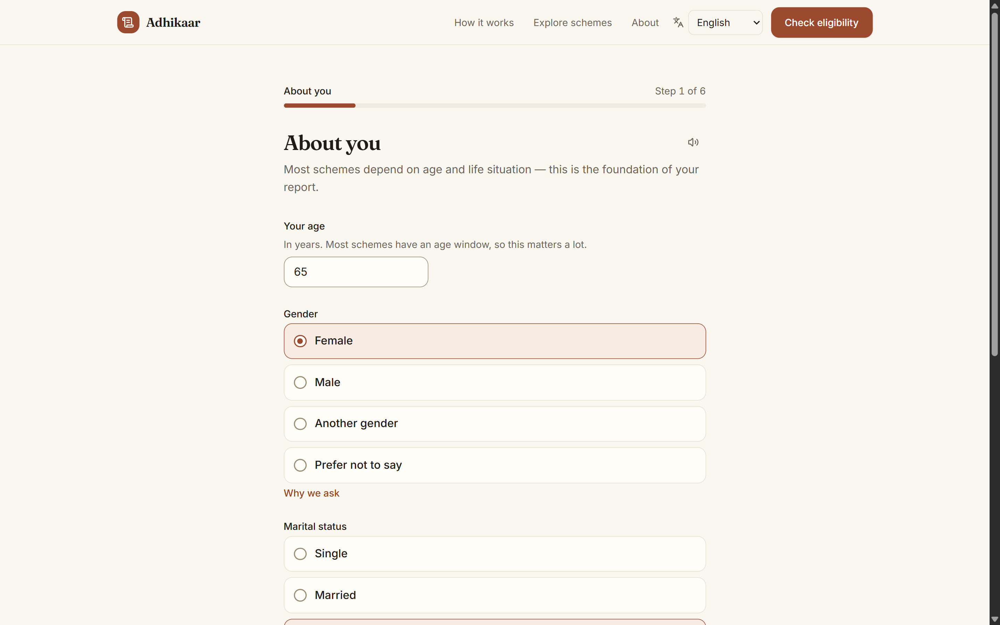
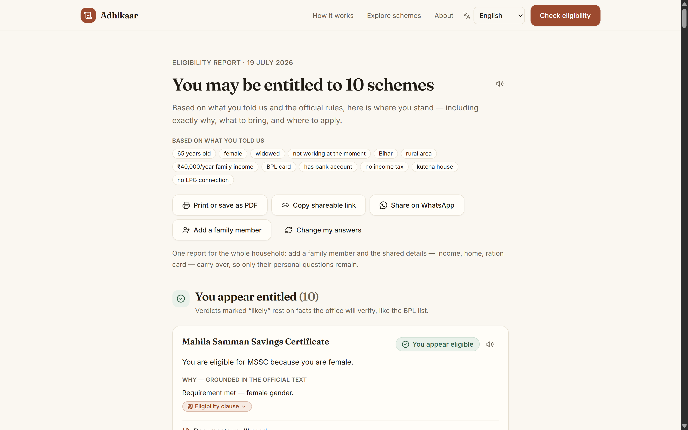
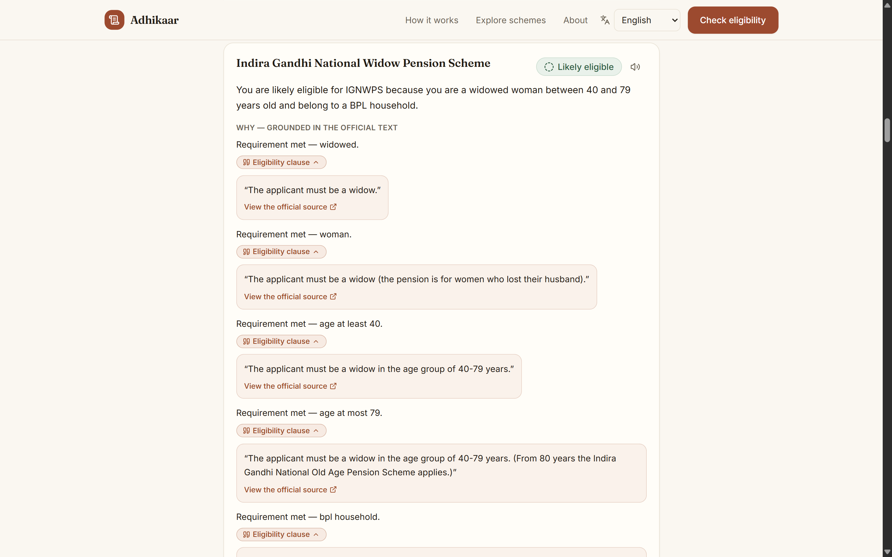
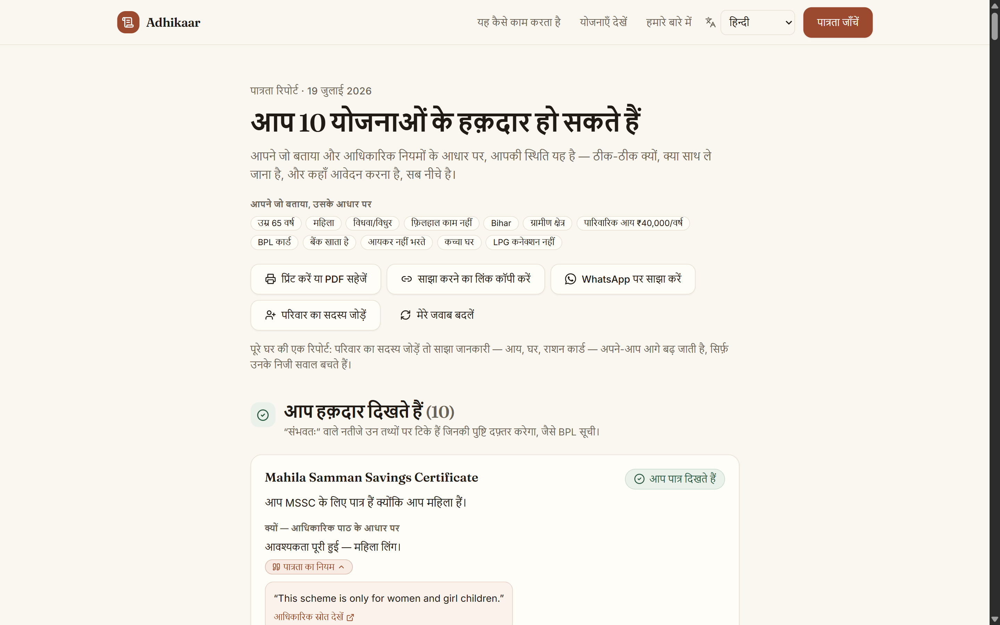
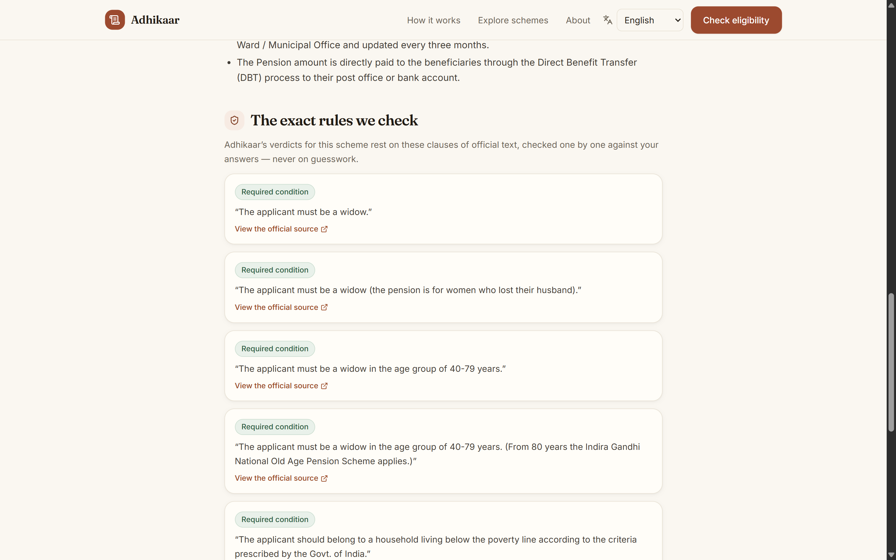
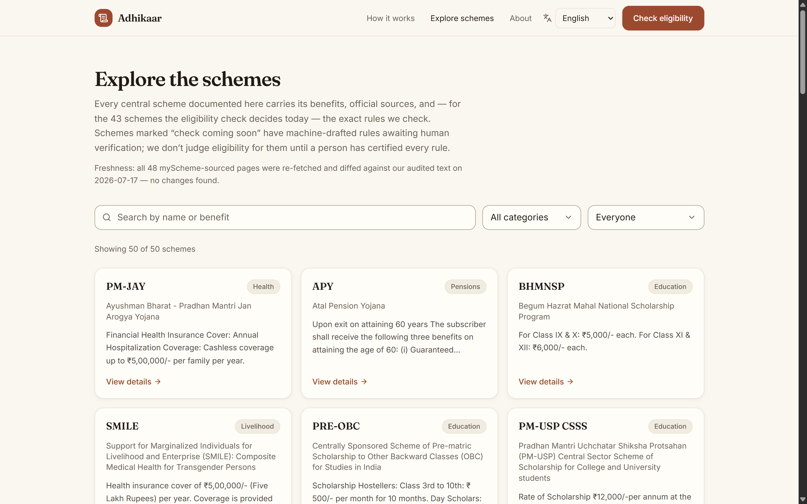

<div align="center">

# अधिकार · Adhikaar

**A verifiable public-benefit reasoning engine for Indian welfare schemes.**

*Describe your situation in plain language. Get back every scheme you're entitled to — with the government's own words as proof.*

[](#coverage)
[](#rules-as-code)
[](#quickstart)
[](#results)
[](#multilingual-by-construction)
[](#stack)
[](#stack)

</div>



---

## The problem

India runs hundreds of welfare schemes. Most people who qualify never claim them — not because the information is secret, but because it is scattered across PDFs, portals, and legalese. A widow in rural Bihar has no realistic way to know she qualifies for four different pensions.

The obvious fix is an LLM chatbot over scheme documents. **That fix is dangerous.**

Retrieval-augmented LLMs cite real documents and still reason wrongly about eligibility — thresholds, age windows, exclusion clauses. During this project's own baseline run, the LLM judged a **62-year-old eligible for PMJJBY** — a scheme with an explicit **18–50 enrollment window that was sitting in its context.**

For a civic tool, a hallucinated entitlement is the worst possible failure: it promises money the law does not grant, and sends someone on a bus to a government office to be turned away.

> ### Core principle
> **Adhikaar never invents an entitlement.** Eligibility is decided by a deterministic, unit-tested rules engine in which every rule links to its source clause in an official government document. The LLM only (a) turns messy prose into structured facts and (b) phrases the verdict kindly. **It never decides.** When a needed fact is missing, the system asks instead of guessing.

---

## Architecture

### 1 · System overview

The LLM sits at the *edges* of the system — parsing input and phrasing output. The decision core is deterministic.



### 2 · The decision boundary

This is the whole thesis. Note what the LLM is **structurally incapable** of doing.



### 3 · Provenance chain

Every sentence in a report traces back to a government document. Grounding holds **by construction**, not by post-hoc checking.



---

## Evaluation

The system was built as a controlled experiment with **exactly one variable**: who decides eligibility.

|  | Phase 1 — baseline | Phase 2 — shipped |
| --- | --- | --- |
| Facts from user text | LLM | LLM |
| Retrieval over official text | BGE-small + Chroma | BGE-small + Chroma |
| **Eligibility decision** | **LLM judgment** | **Deterministic rules engine** |
| Verification | claim/quote containment | grounded by construction |
| Explanation | LLM | LLM *(cannot alter verdicts)* |

### Results

**2026-07-13 · 41 labeled cases · 92 judged (profile, scheme) pairs**

| Metric | LLM-only baseline | Rules-as-code *(shipped)* |
| --- | ---: | ---: |
| Eligibility accuracy | 56.5% | **91.3%** |
| **False positives** *(entitlement promised that is not owed)* | 16 | **0** |
| **False negatives** *(entitlement missed)* | 15 | **0** |
| Declined to judge | 9 | 8 |
| Faithfulness *(claims supported by cited official text)* | 24.4% | **66.8%** |

Both phases share the same retriever and the same generator (Llama 4 Scout 17B via Groq). Faithfulness is scored claim-by-claim by an **independent judge** (Llama 3.1 8B) under a strict standard: a claim with no resolvable citation is unsupported *by definition* — which is precisely what sinks the LLM baseline, and why rule-backed reasons score 2.7x higher.

> **Across 92 judgments the rules engine asserted zero false entitlements and missed zero owed ones.**

**Retrieval** (shared by both phases): precision 0.257 / recall 0.925 — a broad dense sweep reranked by a local cross-encoder that scores *schemes* by their best-matching clause. Chosen over BM25 fusion and plain chunk reranking on measured precision **and** recall.

Reproduce (all LLM calls are disk-cached):

```bash
cd backend
uv run python -m evals.run_eval --phase llm
uv run python -m evals.run_eval --phase rules
```

Raw run artifacts live in `backend/evals/results/`.

---

## What it looks like

### Guided wizard — six steps, no login



### The report — verdict, reasoning, documents, where to apply



### Every claim expands into the government's own words

This is the feature the whole architecture exists to make possible.



### Multilingual by construction

Prose is translated at the API edges. **Verdicts, amounts, scheme names, and official quotes are language-invariant** — notice the citation stays in its original official English while everything around it is Hindi.



### Scheme explorer — the rules are public, not a black box





---

## Key design decisions

### Rules as code

Eligibility lives in versioned YAML — not in prompts, and not in Python branches:

```yaml
# app/rules/schemes/ignwps.yaml (excerpt)
- id: ignwps:age-at-least-40
  condition: { field: age, op: gte, value: 40 }
  quote: "The applicant must be a widow in the age group of 40-79 years."
  section: eligibility
  source_url: https://www.myscheme.gov.in/schemes/ignwps
```

Because rules are **data**, the system gets several properties for free: every verdict carries its citation, rules are unit-testable in isolation, the frontend can publish the exact logic it applies, and adding a scheme becomes an encoding task rather than an engineering one.

### Three-valued logic

Rules evaluate to **pass / fail / unknown** — never a guessed boolean. An `unknown` propagates into a targeted follow-up question instead of a silent assumption. This is why the report distinguishes *"you appear eligible"* from *"likely eligible — the office will verify your BPL status."*

### Human sign-off gate

50 schemes are documented; **43** are decided by the check. The remaining 7 have machine-drafted rules held behind a review gate and are visibly marked *"check coming soon."* A scheme joins the live set only after a person has certified every rule against its official source. **The system never judges eligibility using rules no human has verified.**

### Freshness monitoring

A scheduled job re-fetches every myScheme-sourced page and diffs it against the audited corpus text, surfacing a "last verified" date in the UI and flagging drift for re-review. Government pages change silently; a civic tool that does not notice is worse than no tool.

---

## Coverage

|  | Count |
| --- | ---: |
| Schemes documented in the catalog | **50** |
| Schemes the eligibility check decides | **43** |
| Rules encoded from official text | **126** |
| Languages | **11** |
| Backend tests | **247** |

Languages: English, हिन्दी, বাংলা, मराठी, తెలుగు, தமிழ், ગુજરાતી, ಕನ್ನಡ, മലയാളം, ਪੰਜਾਬੀ, ଓଡ଼ିଆ.

---

## Stack

| Layer | Choice | Why |
| --- | --- | --- |
| Frontend | Next.js 16 · React 19 · Tailwind v4 | Static prerendering for 67 routes; works on low-end phones |
| API | FastAPI · Pydantic v2 | Typed contracts, OpenAPI for free |
| Orchestration | LangGraph | Explicit node graph — the pipeline is inspectable, not implicit |
| Embeddings | BGE-small (ONNX) | CPU-only, no GPU bill |
| Vector store | Chroma | Baked into the image at build time; instant cold start |
| Reranker | MiniLM cross-encoder (ONNX) | Local, free, measurably better than BM25 fusion here |
| LLMs | Gemini 2.5 Flash to Groq Llama 3.3 70B | Free tiers with automatic fallback routing; all calls disk-cached |
| Hosting | HF Spaces (Docker) + Vercel | Free tier end to end |

---

## Repository layout

```
backend/
  app/ingestion/    fetch -> clean -> chunk -> embed -> index (provenance preserved)
  app/retrieval/    dense sweep + cross-encoder rerank over the corpus
  app/rules/        the rules engine + versioned YAML rule repository
  app/agent/        LangGraph pipeline: profile -> retrieve -> decide -> explain
  app/extraction/   LLM-assisted rule drafting + semantic audit (human-gated)
  app/i18n/         translation at the API edges
  app/llm/          disk-cached Gemini/Groq clients + fallback router
  app/api/          FastAPI (OpenAPI-documented)
  evals/            labeled dataset, metrics, faithfulness judge, runner
  tests/            247 tests: every rule in 3 logic states + boundaries + pipeline
frontend/           Next.js app: wizard, cited report, scheme explorer
data/corpus/        cleaned official text (committed, with fetch dates)
data/raw/           raw API responses and source PDFs (provenance)
```

---

## Quickstart

**Prerequisites:** Python 3.11+, Node 20+, [uv](https://docs.astral.sh/uv/)

```bash
git clone https://github.com/Ansh-Goyal01/ADHIKAAR.git && cd ADHIKAAR

# 1 - Keys (both free tiers)
#     https://aistudio.google.com/apikey  |  https://console.groq.com/keys
cp .env.example .env        # add GEMINI_API_KEY and GROQ_API_KEY

# 2 - Backend
cd backend
uv sync
uv run python -m app.ingestion index      # builds the vector index from the committed corpus
uv run uvicorn app.api.main:app --port 8000

# 3 - Frontend (new terminal)
cd frontend
npm install
cp .env.example .env.local                # points at http://localhost:8000
npm run dev
```

Open <http://localhost:3000>. Run the backend tests with `uv run pytest`.

Every rule is tested in all three logic states (pass / fail / unknown) plus boundary values — a 40-year-old and a 39-year-old must land on opposite sides of a 40-year threshold, and the suite says so explicitly.

---

## Deployment

**Backend to Hugging Face Spaces (Docker SDK).** The root `Dockerfile` builds the Chroma index into the image, so the Space answers immediately after cold start rather than indexing on boot. Create a Space, add `GEMINI_API_KEY` and `GROQ_API_KEY` as **Space secrets**, and push. Serves on port 7860.

**Frontend to Vercel.** Set root directory to `frontend/` and `NEXT_PUBLIC_API_URL` to the Space URL. `NEXT_PUBLIC_*` values are baked at build time, so redeploy after changing them.

The API is rate-limited per client IP (10 req/min) and CORS-restricted. The container runs behind a TLS-terminating proxy and therefore trusts `X-Forwarded-For` — without that, every visitor would share a single rate-limit bucket.

---

## Limitations (honest ones)

- **Central schemes only.** 50 are documented; the check decides 43. State schemes — often the most relevant — are not covered. *"Not eligible here" is not "not eligible anywhere."*
- **Self-reported facts.** BPL/SECC membership cannot be verified from a conversation, so such verdicts are explicitly conditional (*likely eligible*).
- **Simplified rules.** Some rarely-triggered exclusions are not encoded (e.g. PM-KISAN's constitutional-post holders); PM-JAY's monthly-income exclusion is approximated from annual income. Every simplification is listed in the rule sign-off notes.
- **PMS-SC provenance.** The official guidelines PDF is a scan; its corpus text is a model transcription cross-checked against the department's pages — flagged for clause-level human verification.
- **Document checklists are incomplete.** 18 of the 50 corpus entries have no documents section upstream; those schemes show a verdict but no checklist.
- **Small eval set.** 41 cases / 92 pairs — these are counts, not significance claims. The faithfulness judge shares a model family with the Phase-1 generator (noted bias risk).
- **Multilingual parity in progress.** Hindi is validated end to end; the other nine Indic languages are machine-translated and under review.
- **Not legal advice.** Final decisions always rest with the implementing authorities.

---

## Roadmap

- Formal verification of the rule base (SMT) — prove no scheme has contradictory or unreachable clauses
- Offline-first PWA: compile rules to a client-side evaluator, verified for parity against the Python engine
- Public eligibility API and MCP server, so other assistants can call a verified engine instead of hallucinating entitlements
- Change detection that opens a pull request when an official clause changes
- State-scheme expansion

---

## License and data

Scheme text belongs to the **Government of India** and is reproduced from public official sources with URLs and fetch dates preserved. No personal data is collected or stored server-side; the eligibility check requires no login and persists nothing about you.

<div align="center">

**Sources:** [myScheme](https://www.myscheme.gov.in/) · ministry guidelines and gazette PDFs *(linked per scheme)*

*Built to be checkable. If a verdict looks wrong, every claim links to the text it came from — go read it.*

</div>
